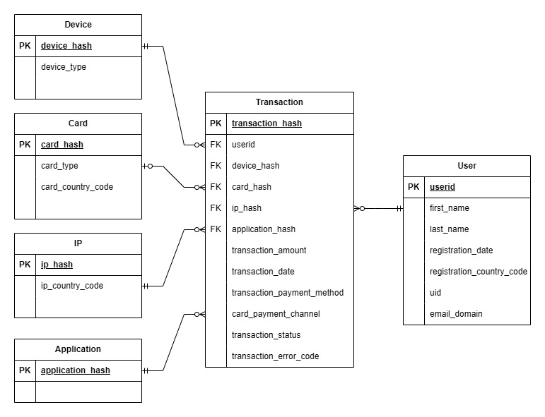
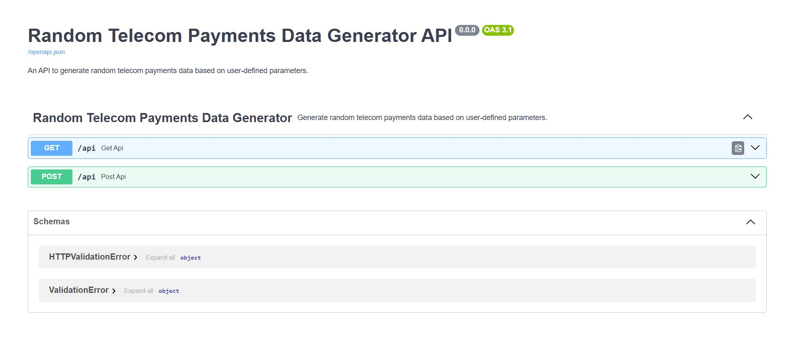

# Random Telecom Payments Generation

## Overview

Randomly simulated data is particularly useful when its real world counterpart is hard to access due to complexity, privacy and security reasons. Moreover, randomly simulated data has additional benefits including reproducibility, scalability and controllability.

This application aims to simulate telecommunication payments using random number generation. It includes typical transaction level relationships and behaviours amongst the user, device, ip, and card entities. It can be used in place of real world telecommunication payments for prototyping solutions and as an education tool.

The data generation algorithm works by first generating user level telecom payments data. Afterwards, the user level data is exploded to transaction level, and any inconsistencies within the data model are removed. Finally, the transaction status and error codes are generated using underlying features within the transaction level data.

### Master File

A stable master version of the Random Telecom Payments data can be found on Kaggle here:

* https://www.kaggle.com/datasets/oislen/randomtelecompayments

## Data Model

The underlying data model present in the simulated telecommunication payments is displayed below.



For a more detailed account of each column in the dataset see the data dictionary:

* https://github.com/oislen/RandomTelecomPayments/blob/main/doc/data_dictionary.csv

## Repository Structure

```
RandomTelecomPayments/
├── .github/
│   └── workflows/
│       ├── deploy-main-push.yml    # CI/CD: tag, scan, test, build and push Docker image on main push
│       └── dev-pull-requests.yml  # CI: Trivy security scan + unit tests on pull requests
├── aws/
│   ├── cons.py                    # AWS constants (region, instance type, etc.)
│   ├── ref/                       # EC2 launch template and fleet config JSON files
│   └── utilities/
│       ├── EC2Client.py           # AWS EC2 client wrapper
│       └── commandline_interface.py
├── config/
│   ├── conda/
│   │   └── RandomTelecomPayments.cmd  # Conda environment setup script
│   └── uv/
│       └── RandomTelecomPayments.cmd  # uv dependency install script
├── data/
│   ├── RandomTelecomPayments.csv      # Main generated transaction-level dataset
│   ├── RandomTelecomUsers.parquet     # Intermediate user-level dataset
│   ├── arch/                          # Archived prior dataset versions (V0.0–V0.3)
│   ├── ref/                           # Reference data (countries, names, emails, smartphones, crime index)
│   ├── report/                        # Analytical outputs (anomaly scores, model files, feature data)
│   ├── temp/                          # Per-country AI-generated temporary CSVs
│   └── unittest/                      # Parquet fixtures used by unit tests
├── doc/
│   ├── data_dictionary.csv            # Column-level data dictionary for the output dataset
│   ├── entity_relationship_diagram.jpg / .drawio
│   ├── fastapi_endpoint.jpg
│   ├── new_hire_tasks.md              # Suggested analysis tasks for new contributors
│   ├── RandomTelecomPayments.postman_collection.json
│   └── issues/                        # Implementation plans for GitHub issues
├── generator/
│   ├── main.py                        # CLI entry point
│   ├── api.py                         # FastAPI application (GET + POST /api)
│   ├── cons.py                        # Global constants: paths, defaults, data model parameters
│   ├── app/
│   │   ├── ProgrammeParams.py         # Parameter validation and transaction_timescale computation
│   │   ├── gen_random_telecom_data.py # Top-level orchestration function
│   │   ├── gen_user_data.py           # User-level DataFrame construction
│   │   └── gen_trans_data.py          # Transaction-level DataFrame construction
│   ├── batch/
│   │   └── gen_bedrock_data.py        # AWS Bedrock batch script to generate reference name/email data
│   ├── objects/
│   │   ├── Application.py             # Application entity (hashes, payment channels)
│   │   ├── Card.py                    # Card entity (hashes, types, country codes, shared mappings)
│   │   ├── Device.py                  # Device entity (hashes, types, shared mappings)
│   │   ├── Ip.py                      # IP entity (hashes, country codes, shared mappings)
│   │   ├── Transaction.py             # Transaction entity (hashes, dates, amounts, statuses)
│   │   └── User.py                    # User entity (IDs, names, country codes, email domains, dates)
│   ├── qa/
│   │   ├── Cards.py                   # QA: card hash → type and country code cardinality
│   │   ├── Ips.py                     # QA: IP hash → country code cardinality
│   │   ├── Transactions.py            # QA: transaction-level field consistency and business rules
│   │   └── Uids.py                    # QA: user-level entity counts and date ordering
│   ├── unittests/
│   │   ├── app/                       # Tests for ProgrammeParams, gen_user_data, gen_trans_data, gen_random_telecom_data
│   │   ├── objects/                   # Tests for each entity class
│   │   └── utilities/                 # Tests for each utility function
│   └── utilities/
│       ├── align_country_codes.py     # Aligns registration / IP / card country codes
│       ├── Bedrock.py                 # AWS Bedrock API wrapper (Llama + Claude)
│       ├── cnt2prop_dict.py           # Converts count dict to proportion dict
│       ├── commandline_interface.py   # argparse CLI definition
│       ├── gen_country_codes_dict.py  # Assigns random European country codes to idhashes
│       ├── gen_country_codes_map.py   # Builds ISO numeric → ISO alpha-2 country code map
│       ├── gen_dates_dict.py          # Assigns random dates within a range to idhashes
│       ├── gen_idhash_cnt_dict.py     # Generates idhashes with Poisson-power counts
│       ├── gen_obj_idhash_series.py   # Expands idhash list into per-user Series
│       ├── gen_random_entity_counts.py # Generates per-user entity count DataFrame
│       ├── gen_random_hash.py         # Generates random hex-style hash strings
│       ├── gen_random_id.py           # Generates random numeric ID strings
│       ├── gen_random_poisson_power.py # Samples from a Poisson-power distribution
│       ├── gen_shared_idhashes.py     # Creates entity-sharing mappings between users
│       ├── gen_trans_rejection_rates.py # Computes per-feature transaction rejection rates
│       ├── gen_trans_status.py        # Determines transaction status and error code per row
│       ├── input_error_handling.py    # Validates input parameter dictionary
│       ├── join_idhashes_dict.py      # Left-joins an attribute dict onto a DataFrame
│       ├── JsonEncoder.py             # Custom JSON encoder for numpy/pandas types
│       ├── multiprocess.py            # Parallel execution via multiprocessing.Pool
│       └── remove_duplicate_idhashes.py # Deduplicates idhash list columns across rows
├── Dockerfile
├── exeDocker.cmd                      # Convenience script to build/run Docker locally
├── pyproject.toml                     # Project metadata and dependencies (uv)
├── requirements.txt                   # Pip-compatible dependency list
└── uv.lock                            # Locked dependency manifest
```

## Development Setup

### Prerequisites

* Python >= 3.12
* [uv](https://docs.astral.sh/uv/) (recommended) or conda

### Installing Dependencies

**Using uv (recommended):**
```
uv sync
```

**Using conda:**
```
conda create --name RandomTelecomPayments python=3.12 --yes
conda activate RandomTelecomPayments
pip install -r requirements.txt
```

## Running the Application

### Application Parameters

| Parameter | Type | Default | Description |
|---|---|---|---|
| `--n_users` | int | 100 | Number of users to generate data for |
| `--use_random_seed` | int (0 or 1) | 0 | Use a fixed random seed for reproducible results (1 = enabled) |
| `--n_itr` | int | 1 | Number of data generation batches; each runs in parallel via multiprocessing |
| `--n_applications` | int | 20000 | Number of applications to generate |
| `--registration_start_date` | str (YYYY-MM-DD) | 2 years ago | Start date for user registrations |
| `--registration_end_date` | str (YYYY-MM-DD) | 1 year ago | End date for user registrations |
| `--transaction_start_date` | str (YYYY-MM-DD) | 1 year ago | Start date for user transactions |
| `--transaction_end_date` | str (YYYY-MM-DD) | today | End date for user transactions |

### Local CLI

Run from within the `generator/` directory:

```
uv run python main.py --n_users 100 --use_random_seed 1 --n_itr 1
```

Or use the provided convenience scripts:

```
# Windows
generator\exeMain.cmd

# Linux / macOS
bash generator/exeMain.sh
```

Output files are written to `data/`:
* `data/RandomTelecomPayments.csv` — transaction-level output dataset
* `data/RandomTelecomUsers.parquet` — intermediate user-level dataset

### Local FastAPI Server

Start the REST API server from within the `generator/` directory:

```
uv run fastapi run api.py
```

Or use the convenience script:

```
# Windows
generator\exeApi.cmd

# Linux / macOS
bash generator/exeApi.sh
```

Once running, navigate to [http://localhost:8000/docs](http://localhost:8000/docs) to access the interactive API documentation.



The API exposes two endpoints:

| Method | Path | Description |
|---|---|---|
| GET | `/api` | Generate data using query string parameters |
| POST | `/api` | Generate data using a JSON request body |

### Docker

The latest version of the Random Telecom Payments app is available as a [Docker](https://www.docker.com/) image on Docker Hub:

* https://hub.docker.com/repository/docker/oislen/randomtelecompayments/general

Pull the image:

```
docker pull oislen/randomtelecompayments:latest
```

#### Command Line Interface

Generate data for 1000 users across 2 iterations:

```
docker run --name rtp oislen/randomtelecompayments:latest --n_users 1000 --use_random_seed 1 --n_itr 2
```

Extract the generated CSV from the container:

```
docker cp rtp:/home/user/RandomTelecomPayments/data/RandomTelecomPayments.csv %userprofile%\Downloads\RandomTelecomPayments.csv
```

#### FastAPI Interface

Run the container with the FastAPI server exposed on port 8000:

```
docker run --name rtp --publish 8000:8000 --entrypoint uv --rm oislen/randomtelecompayments:latest run fastapi run generator/api.py
```

Navigate to [http://localhost:8000/docs](http://localhost:8000/docs) to access the interface.

## Running Unit Tests

Unit tests are organised under `generator/unittests/` and mirror the source directory structure (`app/`, `objects/`, `utilities/`).

Run all tests from the repository root:

```
# Windows
generator\exeUnittests.cmd

# Linux / macOS / Docker
bash generator/exeUnittests.sh
```

Or run directly with `uv` from the repository root:

```
uv run python -m unittest discover generator/unittests/utilities
uv run python -m unittest discover generator/unittests/objects
uv run python -m unittest discover generator/unittests/app
```

Unit tests are also executed automatically on every pull request and push to `main` via GitHub Actions (see `.github/workflows/`).

## CI/CD

Two GitHub Actions workflows are configured:

| Workflow | Trigger | Jobs |
|---|---|---|
| `dev-pull-requests.yml` | Pull request → `dev` or `main` | Trivy filesystem security scan; Python unit tests |
| `deploy-main-push.yml` | Push → `main` | Release tag; Trivy filesystem scan; Python unit tests; Docker Hub image build and push; Trivy image scan |

## Reference Data

The generator relies on the following reference files in `data/ref/`:

| File | Description |
|---|---|
| `Countries-Europe.csv` | European country list with ISO codes and populations |
| `Countries.csv` | Global country populations |
| `country_crime_index.csv` | Crime index per country (used to derive rejection rates) |
| `email-domains.csv` | Email domain reference list with probability weights |
| `llama_first_names.csv` | AI-generated first names per European country |
| `llama_last_names.csv` | AI-generated last names per European country |
| `llama_email_domains.csv` | AI-generated email domains per European country |
| `smartphones.csv` | Smartphone models with OS and rating (used to generate device types) |

Reference name and email data can be regenerated using AWS Bedrock (requires credentials in `.creds/sessionToken.json`):

```
uv run python generator/batch/gen_bedrock_data.py --data_point first_names --run_bedrock
uv run python generator/batch/gen_bedrock_data.py --data_point last_names --run_bedrock
uv run python generator/batch/gen_bedrock_data.py --data_point email_domains --run_bedrock
```
